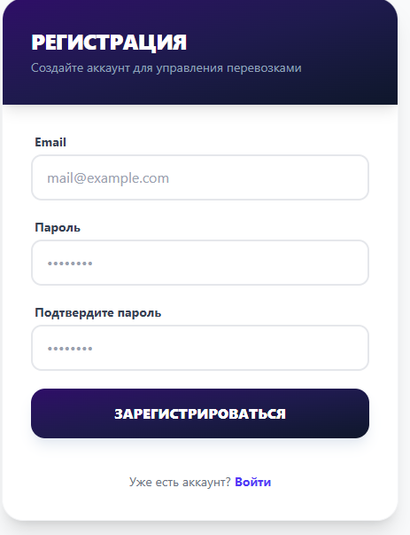
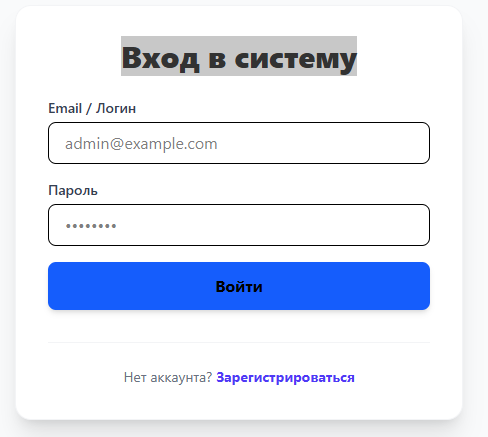

# Trucking App

Приложение для управления грузоперевозками.

## Стек технологий
- **Backend:** ASP.NET Core 9, Identity API, Entity Framework Core
- **Frontend:** React, Axios (с интерцепторами для Bearer-токенов), Tailwind CSS
- **Database:** Postgres
- **Logging:**  Serilog

## Как запустить локально
Убедитесь,что  у вас установлены .NET SDK 9.0 или выше, Node.js  и EF Core CLI Tools.
### 1. База данных
Создайте новую базу данных, используя клиент Postgres. Имя базы может быть,например, truckingapp.

### 2. Бэкенд 
Перейдите в папку сервера:
```bash
cd TruckingApp.Server
```
Укажите строку подключения к базе в файлах appsettings.json и appsettings.Development.json либо в User Secrets:
```bash
dotnet user-secrets set "ConnectionStrings:DefaultConnection" "Ваша_строка_подключения"
```
Примените все EF миграции из папки Migrations, которые создадут таблицы для работы с пользователями и таблицу заказов:
```bash
dotnet ef database update
```
Чтобы React-приложение (фронтенд) могло общаться с ASP.NET Core (бэкенд) по HTTPS в режиме разработки нужно установить доверие к сертификату (иначе браузер будет блокировать запросы как небезопасные)
```bash
dotnet dev-certs https --trust
```
Соберите и запустите серверный проект через HTTPS:
```bash
dotnet run --launch-profile https
```
### 3. Фронтенд
Перейдите в папку клиента. В конфигурации клиента (vite.config.ts) установлен запуск через HTTPS.
```bash
cd ../truckingapp.client
npm install
npm run dev
```

## Авторизация
Проект использует встроенные эндпоинты Identity. Токен сохраняется в `localStorage` и подставляется интерцептором `Axios` в заголовок `Authorization`.
При запуске проекта необходимо авторизоваться, предварительно создав пользователя с помощью формы регистрации, которая доступна по ссылке с формы логина.
Каждый пользователь видит только заказы, которые создал сам. Номер заказа генерируется сервером.

